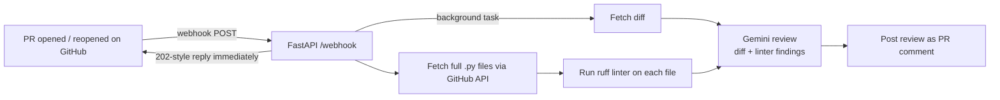

# ReviewPilot

**An AI pull-request reviewer that checks the facts before it gives an opinion.**

ReviewPilot listens for GitHub pull-request events, runs a real linter on the changed Python files, and then asks an LLM to review the diff *with those linter findings in hand*. The review is posted back to the PR as a comment automatically, with no manual trigger.

Most "AI code review" bots send the diff to a model and post whatever comes back. The weak spot is that the model guesses. ReviewPilot grounds the review in tool output first: anything the linter can prove (undefined names, unused imports) is treated as a verified fact, and the model spends its judgment on what a linter can't see, such as edge cases, risky patterns and logic bugs.

---

## How it works



1. **Webhook intake.** GitHub sends a `pull_request` event to `POST /webhook`. The server ignores pings and any action other than `opened` / `reopened`, and replies instantly. The slow review runs in a FastAPI background task so GitHub's webhook never times out.
2. **Gather evidence.** ReviewPilot downloads the PR diff, then asks the GitHub API which files changed and fetches the full contents of every changed `.py` file (deleted files are skipped). The linter needs whole files, not diff fragments.
3. **Run the tool.** Each file is linted with [ruff](https://github.com/astral-sh/ruff), and the findings are collected into a report.
4. **Grounded review.** The model receives both the diff and the linter report, with instructions to treat the linter findings as verified facts, explain them plainly, and then add its own judgment on bugs, edge cases and clarity.
5. **Post back.** The review is posted as a comment on the PR through the GitHub REST API.

---

## Evaluation

A reviewer is only useful if you can measure it, so ReviewPilot ships with a small eval harness.

- **`eval_dataset.py`** is a labeled answer key: code samples with known problems, plus the keywords a correct review must mention. It deliberately mixes:
  - bugs a linter alone can catch (undefined variable, unused import),
  - bugs only reasoning can catch (mutable default argument, divide-by-zero on empty input),
  - one clean file, to check whether the reviewer invents problems.
- **`eval_runner.py`** reviews every case using the same linter-plus-LLM engine the live bot uses, and saves the output to `eval_results.json`.
- **`eval_score.py`** grades the saved reviews and reports recall, precision and false alarms.

**Current results (5 cases):**

| Metric | Result |
|---|---|
| Recall (real bugs caught) | 4 / 4 = **100%** |
| Precision (flags that were real) | 4 / 5 = **80%** |
| False alarms on clean code | 1 |

Both reasoning-only bugs were caught, which the linter alone would have missed. The one false alarm on clean code is the classic over-flagging trade-off of LLM reviewers, and it is the main thing the roadmap targets. The dataset is intentionally small right now, so treat these numbers as a baseline rather than a benchmark.

Reproduce the scores from the saved results without any API key:

```bash
python eval_score.py
```

---

## Project structure

| File | What it does |
|---|---|
| `webhook_server.py` | FastAPI app. Receives GitHub webhooks, filters events, runs the review in the background and posts it. |
| `review_with_tools.py` | The core reviewer: diff + linted files → grounded Gemini review. |
| `linter_tool.py` | The ruff "tool": lints a code string and returns the findings. |
| `fetch_py_files.py` | Lists a PR's changed files and downloads full `.py` contents. |
| `pr_reviewer_step2.py` | Helpers for fetching a diff, parsing PR URLs and posting PR comments. |
| `pr_reviewer.py` | The original diff-only reviewer (prints to terminal). Kept as the baseline. |
| `lint_pr.py` | Runs only the linter over a real PR's files, with no LLM. |
| `eval_dataset.py` / `eval_runner.py` / `eval_score.py` | The eval harness described above. |

---

## Running it locally

**Requirements:** Python 3.10+, a [Gemini API key](https://aistudio.google.com/apikey), and a GitHub personal access token that can comment on the target repo.

```bash
git clone https://github.com/Mridul-Bhola/ReviewPilot.git
cd ReviewPilot
python -m venv .venv && source .venv/bin/activate
pip install -r requirements.txt

cp .env.example .env        # then fill in your keys
export $(cat .env | xargs)  # or export GEMINI_API_KEY / GITHUB_TOKEN yourself
```

**Review a single PR from the terminal:**

```bash
python review_with_tools.py   # set PR_URL at the top of the file first
```

**Run it as an automatic reviewer:**

```bash
uvicorn webhook_server:app --port 8000
ngrok http 8000               # in a second terminal
```

Then in your GitHub repo, go to **Settings → Webhooks → Add webhook**:
- Payload URL: `https://<your-ngrok-url>/webhook`
- Content type: `application/json`
- Events: **Pull requests**

Open a PR with a Python file and the review appears as a comment within seconds.

---

## Roadmap

- [ ] **True tool-calling loop:** let the model decide which tools to run (lint, tests, static analysis) and when, instead of a fixed pipeline, with iteration caps and timeouts.
- [ ] **Sandboxed execution:** run tools and tests inside a Docker container rather than on the host.
- [ ] **Durable job queue:** move from FastAPI background tasks to Redis + Celery so reviews survive restarts and can be retried.
- [ ] **Confidence gating:** suppress low-confidence comments to cut false alarms.
- [ ] **Larger eval set:** grow the dataset from real merged PRs, and trace per-run latency and cost.
- [ ] **Webhook signature verification** (`X-Hub-Signature-256`) and inline, line-level review comments.
- [ ] **React dashboard** for review history.

---

## Tech stack

Python · FastAPI · Gemini API (`google-genai`) · GitHub REST API · ruff
